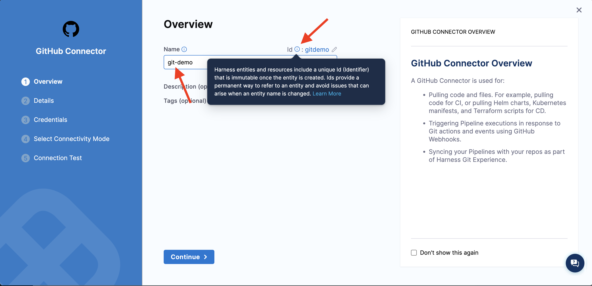
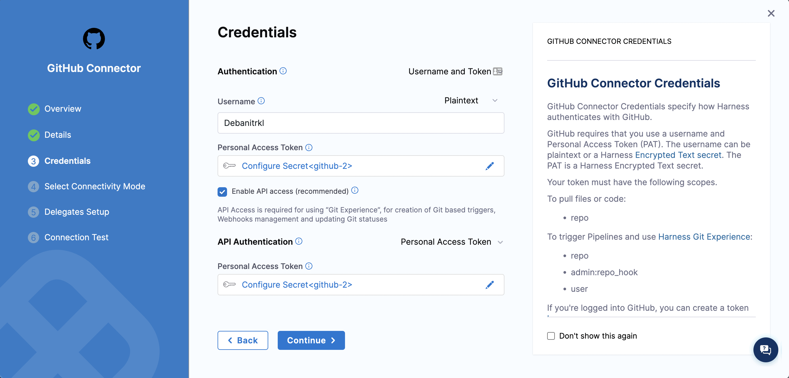
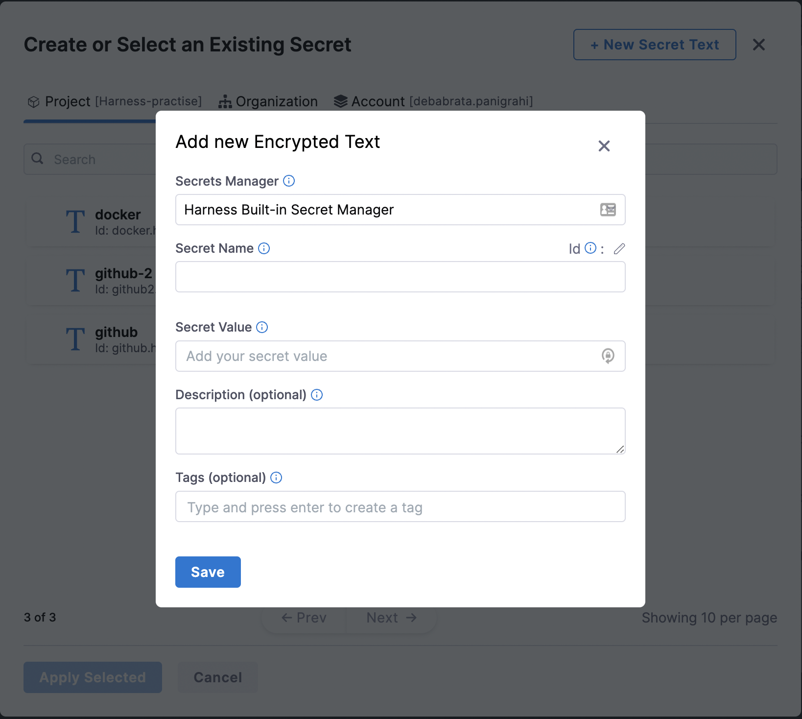
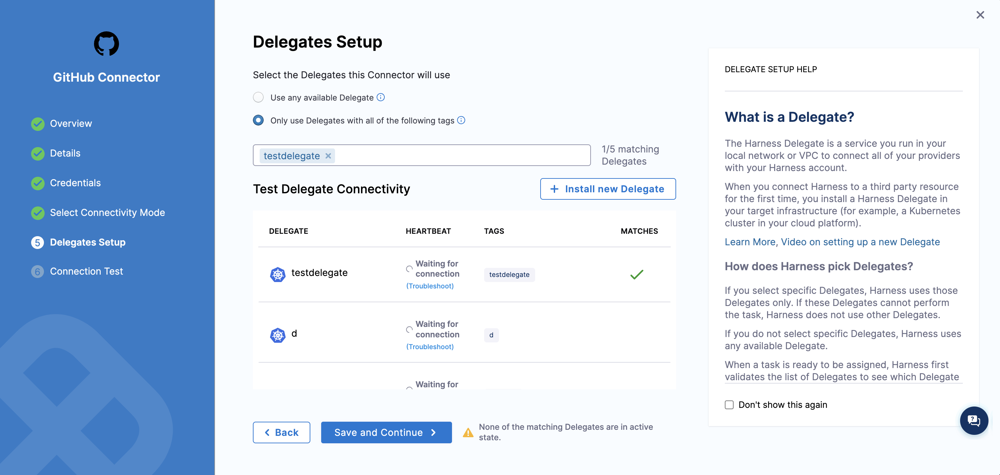

Are you confused with terminologies like Access Token, Access Control, and Personal Access Token while creating connectors? In this article, we will discuss a few such terminologies on the Harness platform, what they mean and what values should be entered against them. 

So, in Harness when you are using CI/CD to build or deploy we need access to your source code repository and the enterprise cloud for deployments, and hence encrypted secrets are asked as input. In this blog, I have focused on the common errors faced by beginners while trying to setup GitHub connectors. 

To begin with:

1. Select new connector and from the new connector tab select Github under Code Repositories

    

2. Now it’s time to give a name to your connector, but there’s some [entity name convention](https://docs.harness.io/article/7rsydu6iq2) which you need to follow while naming it. 
Some common errors observed here are :
For ease of understanding across orgs and easy identification, you can also add tags and give an apt description to your connector. 

    

3. It’s time for one of the most confusing steps of the process, giving the exact address for your connector which comes in two levels
    1. Account 
    2. Repository

    What’s most intriguing and that first time user’s like me, made a mistake in selecting the connection type,  so the suggested method is HTTP for first timers for ease of use and you can fetch this URL for your repository directly from the search bar of your browser or from local clone information available in the repository, which has the following format ``https://github.com/<account-name>`` for account URL’s type and ``https://github.com/<account-name>/<repository-name>`` for Repository URLs.   

    

4. Now, it’s time to add credentials, which are required for the authentication to GitHub repository. 

    

    The value in the username field is the same as your GitHub username, and now the most crucial step of adding credentials, is adding the Personal Access Token as a secret, for that, you need to generate the PAT for your account by allowing adequate repo source control permission, which could be done by following the steps [here](https://docs.github.com/en/authentication/keeping-your-account-and-data-secure/creating-a-personal-access-token#creating-a-token). Further if you already have a PAT as a secret you could just skip to selecting the same, or else you need to add the generated PAT by selecting the “+New Secrets” and mentioning the PAT under the “Secret Value” field.

    
    
    Be careful not to add your GitHub password under the secrets for GitHub, as some users tend to do this and the connector fails to connect. 

5. Now while connecting to the provider it’s suggested to go for the connect through delegate step as it would allow delegates to perform tasks for you based on your requirements. 

    

6. Going further to the Delegate Setup step, I would suggest using any available delegate as a beginner, or if you want to use a particular delegate, select the same and click on the empty field under the same to select and add the delegates. 

7. What’s important to consider here is if you’re an absolute beginner using Harness for the first time, or have never created a delegate, please consider creating a delegate first by selecting the “Install new delegate” and following the resources mentioned [here](https://docs.harness.io/article/0slo2gklsy-delegate-how-tos), to move forward and add a connector. 

Need further help? 
Feel free to ask questions at [community.harness.io](https://community.harness.io/c/harness/7) or  [join](https://join.slack.com/t/harnesscommunity/shared_invite/zt-y4hdqh7p-RVuEQyIl5Hcx4Ck8VCvzBw) community slack to chat with our engineers in product-specific channels like:

1. [#continuous-delivery](https://join.slack.com/t/harnesscommunity/shared_invite/zt-y4hdqh7p-RVuEQyIl5Hcx4Ck8VCvzBw)  Get support regarding the CD Module of Harness.
2. [#continuous-integration](https://join.slack.com/t/harnesscommunity/shared_invite/zt-y4hdqh7p-RVuEQyIl5Hcx4Ck8VCvzBw) Get support regarding the CI Module of Harness. 
